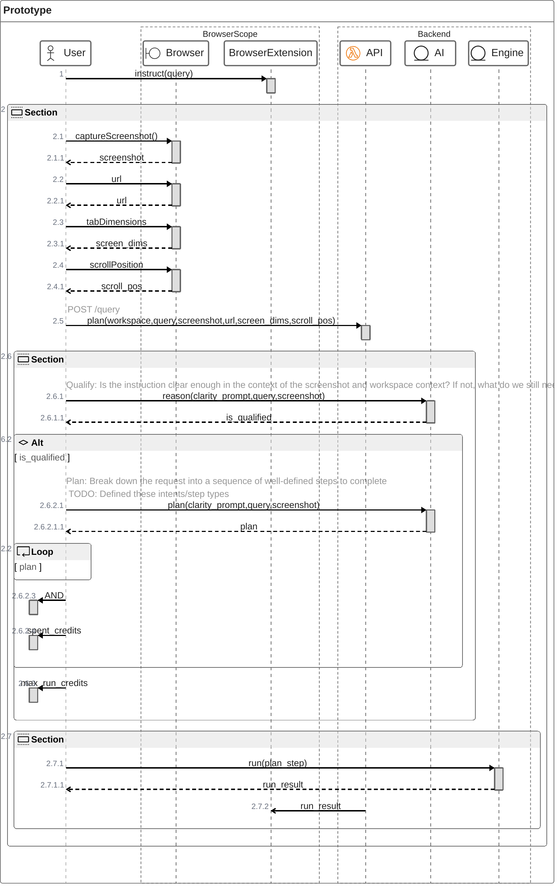

# Extension: Chorebot

This extension built with WXT + React is an attempt to provide browser users an AI-enabled chore-running machine.

## Background

See https://github.com/wxt-dev/examples/tree/main/examples for some examples for specific cases.

Here are some capabilities that we will need to verify:
- [ ] Capture screenshot along with dimensions and scroll position
  See [`browser.tabs.captureVisibleTab()`](https://github.com/wxt-dev/examples/blob/main/examples/active-tab-screenshot/entrypoints/background.ts#L6C44-L6C51) which we can trigger in background.ts and then use this to send the image to the processing backend.
- [ ] Overlay polygons that track scrolling position on the active tab
  See https://github.com/wxt-dev/examples/tree/main/examples/vue-overlay for a non-scrolling variant in Vue.
- [ ] Open an audio stream to capture audio and route back audio (for the conversational thing)
  Seems possible based on https://developer.chrome.com/docs/extensions/how-to/web-platform/screen-capture. We may need to use the Offscreen API `chrome.offscreen` for a smoother experience (i.e.: not disrupting the UX on the active tab).
- [ ] Check ability to switch active tab
- [ ] Check ability to operate across multiple tabs

### User TODOs

- [ ] Stub sidebar/sidepane for the main UI
- [ ] Create chat input box where user can add their prompt
- [ ] Create workspace selection dropdown, where user to scope the context to a given workspace
- [ ] Create Status report list where user can see what the machine is doing

### Dev TODOs

> [!NOTE]
> These are just nice things to simplify development

- [ ] Add Storybook to simplify component development