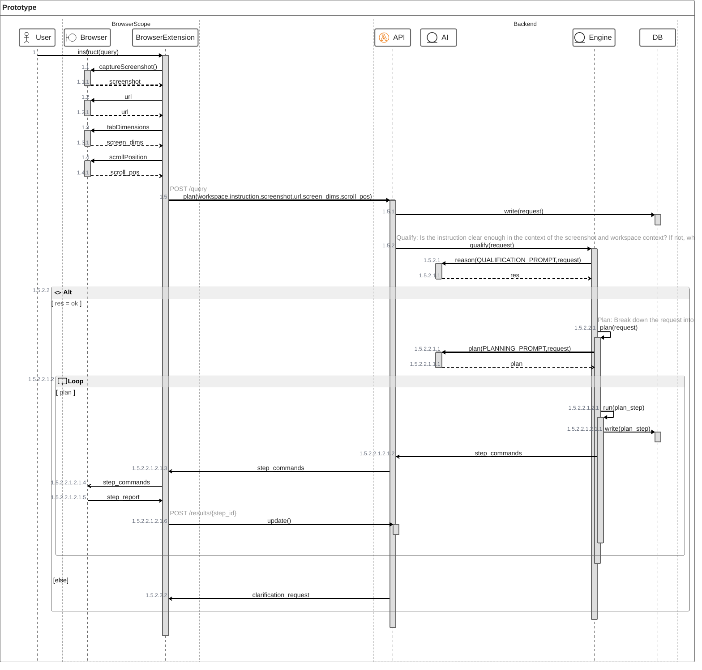

# Extension: Chorebot

This extension built with WXT + React is an attempt to provide browser users an AI-enabled chore-running machine.

> [!WARNING]
> The setup is a bit wonky in that you the sidepanel is only accessible after opening the popup and pressing a button there to make the sidepanel visible upon a next attempt at opening the extension. Nothing I wanted to try to figure out now as the Loom should suffice to get anyone to the sidepanel: https://www.loom.com/share/a8ddde8e2e184909b6a47d23f9561d3c?sid=d1c28725-65ca-4b6b-b324-b26a87acc92a

## Background

See https://github.com/wxt-dev/examples/tree/main/examples for some examples for specific cases.

Here are some capabilities that we will need to verify:
- [ ] Capture screenshot along with dimensions and scroll position
  See [`browser.tabs.captureVisibleTab()`](https://github.com/wxt-dev/examples/blob/main/examples/active-tab-screenshot/entrypoints/background.ts#L6C44-L6C51) which we can trigger in background.ts and then use this to send the image to the processing backend.
- [ ] Overlay polygons that track scrolling position on the active tab
  See https://github.com/wxt-dev/examples/tree/main/examples/vue-overlay for a non-scrolling variant in Vue.
- [ ] Open an audio stream to capture audio and route back audio (for the conversational thing)
  Seems possible based on https://developer.chrome.com/docs/extensions/how-to/web-platform/screen-capture. We may need to use the Offscreen API `chrome.offscreen` for a smoother experience (i.e.: not disrupting the UX on the active tab).
- [ ] Check ability to switch active tab
- [ ] Check ability to operate across multiple tabs

### User TODOs

- [ ] Stub sidebar/sidepane for the main UI
  see example code from V0 at https://v0.dev/chat/chrome-extension-design-TW1iiZvxgcp?b=b_6mq1WcixGYZ
- [ ] Create chat input box where user can add their prompt
- [ ] Create workspace selection dropdown, where user to scope the context to a given workspace
- [ ] Create Status report list where user can see what the machine is doing
- [ ] Defined intents/step types

> [!WARNING]
> Seems like ZenUML is too new for GH support quite yet, so go to the MermaidJS Live Editor to see what this is all about.

#### Action Types
##### Plan
Plan out an instruction into a set of known actions
##### Data-entry
Note to instruct that data-entry in gdoc, gsheet and webforms work differently. For example, when the structure of a gsheet is known, we can compose the CSV variant of the input in the target cells (provided that they are adjacent) select the top-left cell of a range and paste the content into it.
$\text{enter_data()}$
##### Browse for details
$\text{browse(website, details=[])}$
Browse a given website for a limited set of details and keep track of which details have been sourced and which haven't
##### Search internet for details
$\text{websearch(query)}$
Formulate and run a search query to answer a specific detail.

##### Mock case

Filling in the example from https://www.figma.com/design/DzYFKunOnxlh39hQ5EBJVF/hackathon?node-id=0-1&p=f&t=FjS9iyjDoqwuewo0-0 should produce a trace somewhat similar to the following:
1. Query: $\text{query(instruction, screenshot, dimensions, scroll position)} \to \{ ok | error, \text{list of lacking or conflicting information}\}$
2. Plan: $\text{plan(instruction, screenshot)} \to \text{list of steps to execute}$

   in the gsheet case, the screenshot should indicate that we are looking at a spreadsheet and that there is a series of adjacent cells to be filled out for a given set of collumns. Part of the plan should include instructions to source the data to fill into every column. In a most naive case, for every entry and every field in the table, we conduct a web search, with a preference for the subject of interest's own website.
3. Websearch: Execute the individual websearches to extract the value of interest. Conduct only 1 search per entry (no recursive search) and if we fail to get an answer, that's just how scrappy we are right now.
4. There is a case for aggregation of the data and then data-entry or bulk data-entry. Preference should be for data entry for economic reasons right now, because any isolated data entry attempt may mutate the state of the screen such that we will have to collect screenshot raw and metadata in order to reassess which events to trigger for subsequent input attempts (this because bounding boxes of inputs fields like cells may change upon entry).

### Dev TODOs

> [!NOTE]
> These are just nice things to simplify development

- [ ] Add Storybook to simplify component development